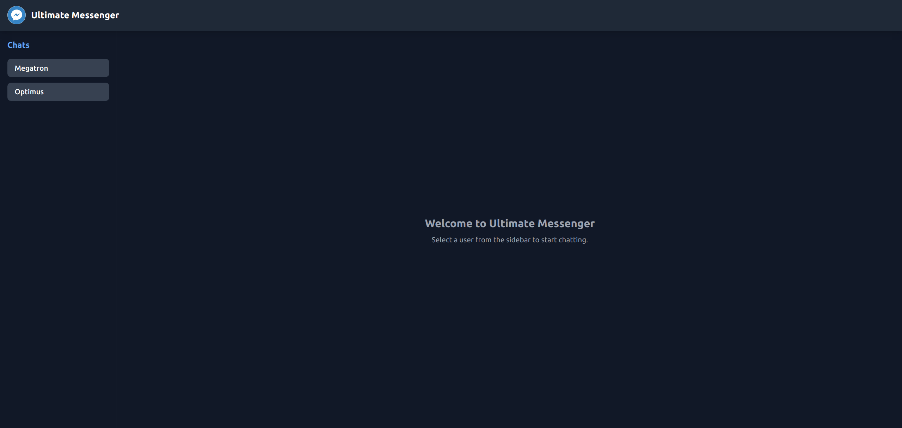
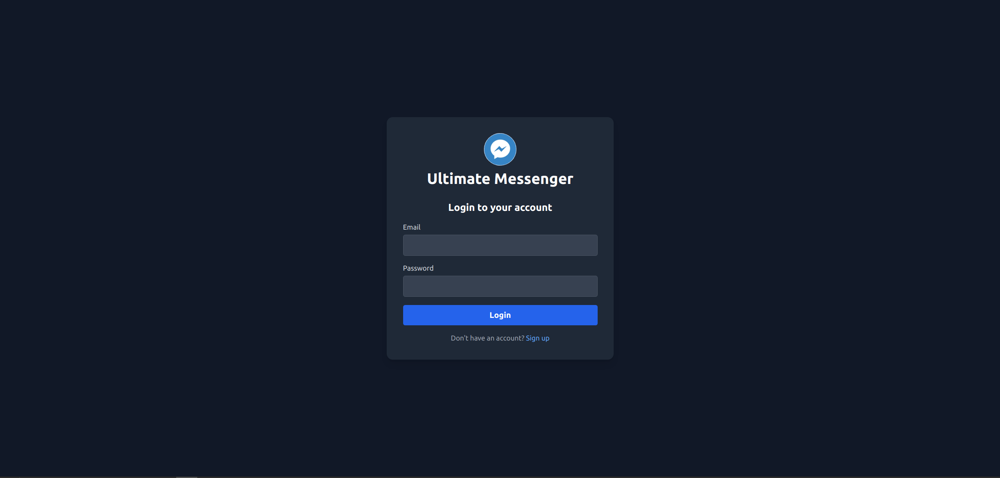
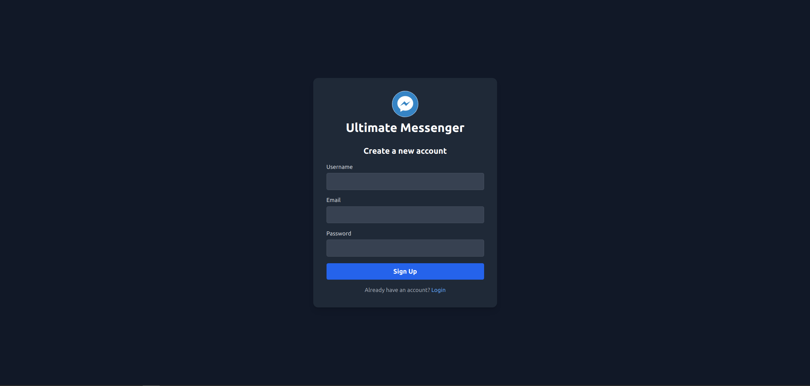
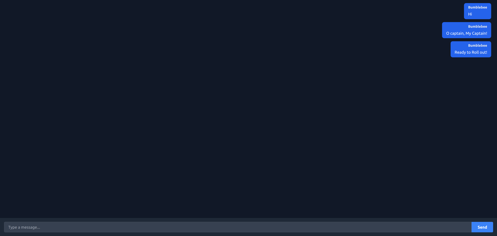

# Messaging App

A full-stack real-time messaging web app using Node.js with Express for backend, PostgreSQL with Prisma ORM for database and HTML/Tailwind CSS with EJS for frontend.

# Features

- Real-time messaging with socket.io
- RESTful API in Node.js runtime with Express
- Secure login/signup using JsonWebTokens(JWTs)
- PostgreSQL for database with Prisma ORM

## Demo

<p align="center">
  
</p>
<p align="center">
  
</p>
<p align="center">
  
</p>
<p align="center">
  
</p>

## Usage

```bash
git clone https://github.com/Kumar-Vedant/MessagingApp.git
```

1. Install all dependencies from package.json using npm.
2. Set up your .env file with DATABASE_URL, PORT and JWT_SECRET.
3. Make sure your Database is running.
4. Run `bash nodemon run server`

## Tech Stack

- Server: JavaScript, Node.js, Express
- Client: Tailwind CSS, EJS
- Database: PostgreSQL, Prisma

## License
